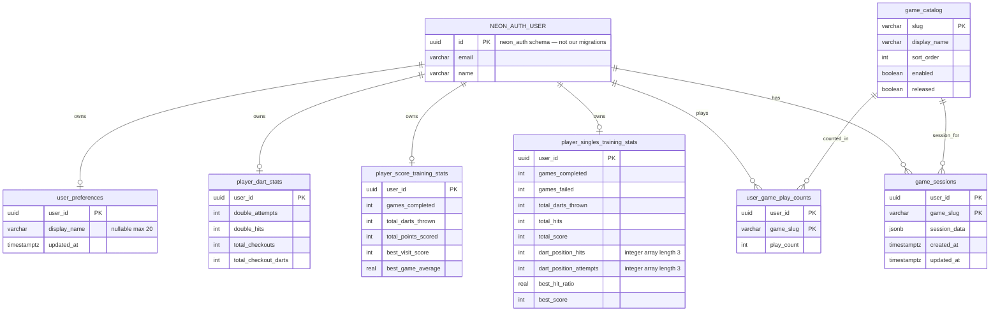

# Blobs → Neon Postgres Migration — Design Spec

> Input for `writing-plans` skill.

**Date:** 2026-06-18  
**Branch:** TBD  
**Scope:** Replace all Netlify Blobs usage in `app/src/lib/server/data/` with Neon Postgres via Drizzle ORM. Neon Auth is already live. Clean start — no blob → DB data migration.

**Supersedes:** prior Netlify Database migration spec (removed after Neon migration)

---

## 1. Overview

Dart Counter stores all dynamic app data via `@netlify/blobs` across 8 data modules and 6 blob stores. Neon Auth is provisioned and wired (`session.userId` = Neon `user.id` UUID). `DATABASE_URL` is configured. This migration swaps blob I/O for Neon Postgres.

| Decision | Choice |
|---|---|
| Database | Neon Serverless Postgres |
| Production data | **Clean start** — no blob → DB migration script |
| Schema shape | **Approach A (hybrid)** — structured columns for scalars; `jsonb` for active game sessions |
| Rollout | Incremental — one store/module group per phase |
| ORM | Drizzle (`drizzle-orm`, `drizzle-kit`) |
| Runtime driver | `@neondatabase/serverless` + `drizzle-orm/neon-http` (Netlify isolated serverless) |
| `user_id` type | `uuid` (matches Neon Auth) |
| Blob package | Removed entirely at end (no file/asset storage in app) |

### Current blob stores

| Store | Key pattern | Data module(s) |
|---|---|---|
| `user-preferences` | `default` (global) | `preferences.ts` |
| `game-types` | `catalog` | `games.ts` |
| `user-game-stats` | `{userId}` | `games.ts` |
| `game-sessions` | `{userId}:{slug}` | `games.ts`, `*-session.ts` (×3) |
| `player-dart-stats` | `{userId}` | `player-dart-stats.ts` |
| `player-score-training-stats` | `{userId}` | `player-score-training-stats.ts` |
| `player-singles-training-stats` | `{userId}` | `player-singles-training-stats.ts` |

### Unchanged boundaries

- API route shapes (except preferences callers pass `userId` internally)
- Astro pages (preferences callers gain `session.userId`)
- Shared types and validators (`lib/shared/`)
- Public exports of data modules (same function names; preferences gains `userId` param)

---

## 2. ERD



**No FK to `neon_auth`:** Neon Auth owns its schema. App tables store `user_id` as `uuid` without cross-schema FK constraints.

---

## 3. Architecture

```
┌─────────────────────────────────────────┐
│  API routes / Astro pages               │
└─────────────────┬───────────────────────┘
                  │ unchanged imports
┌─────────────────▼───────────────────────┐
│  lib/server/data/*.ts  (same exports)   │
└─────────────────┬───────────────────────┘
                  │
┌─────────────────▼───────────────────────┐
│  db/index.ts  — drizzle({ schema })     │
│  db/schema.ts — Drizzle table defs      │
└─────────────────┬───────────────────────┘
                  │ neon-http (per request)
┌─────────────────▼───────────────────────┐
│  Neon Postgres (DATABASE_URL)           │
│  migrations → drizzle/migrations/       │
└─────────────────────────────────────────┘
```

### New files

| File | Purpose |
|---|---|
| `app/db/schema.ts` | All Drizzle table definitions |
| `app/db/index.ts` | `drizzle({ client: neon(DATABASE_URL), schema })` |
| `app/drizzle.config.ts` | Drizzle Kit config; `out: "./drizzle/migrations"` |
| `app/drizzle/migrations/*.sql` | Generated migration SQL |

### New dependencies

```bash
npm install drizzle-orm
npm install -D drizzle-kit
```

`@neondatabase/serverless` is already installed.

### New scripts (`package.json`)

```json
{
  "db:generate": "drizzle-kit generate",
  "db:migrate": "drizzle-kit migrate"
}
```

- `db:generate` — writes migration SQL from schema changes
- `db:migrate` — applies pending migrations (uses `DATABASE_URL_UNPOOLED` in config)

### Migration rules (Neon)

- Use **pooled** `DATABASE_URL` for runtime queries (`neon-http`)
- Use **unpooled** `DATABASE_URL_UNPOOLED` for `drizzle-kit migrate` (DDL)
- Commit schema + migration file together
- Apply migrations to dev branch before production deploy

---

## 4. Schema (Approach A — hybrid)

### `user_preferences`

| Column | Type | Notes |
|---|---|---|
| `user_id` | `uuid` PK | `session.userId` |
| `display_name` | `varchar(20)` nullable | |
| `updated_at` | `timestamptz` | default now |

**Fix:** Replaces global blob key `"default"` with per-user rows.

### `game_catalog`

| Column | Type | Notes |
|---|---|---|
| `slug` | `varchar` PK | |
| `display_name` | `varchar` | |
| `sort_order` | `integer` | |
| `enabled` | `boolean` | |
| `released` | `boolean` | |

Seeded via DML migration from `SEED_GAMES` in `lib/shared/games/types.ts`. `reconcileCatalog()` behavior preserved on read.

### `user_game_play_counts`

| Column | Type | Notes |
|---|---|---|
| `user_id` | `uuid` | composite PK with `game_slug` |
| `game_slug` | `varchar` | |
| `play_count` | `integer` | default 0 |

### `player_dart_stats`

| Column | Type |
|---|---|
| `user_id` | `uuid` PK |
| `double_attempts` | `integer` default 0 |
| `double_hits` | `integer` default 0 |
| `total_checkouts` | `integer` default 0 |
| `total_checkout_darts` | `integer` default 0 |

### `player_score_training_stats`

| Column | Type |
|---|---|
| `user_id` | `uuid` PK |
| `games_completed` | `integer` default 0 |
| `total_darts_thrown` | `integer` default 0 |
| `total_points_scored` | `integer` default 0 |
| `best_visit_score` | `integer` default 0 |
| `best_game_average` | `real` default 0 |

### `player_singles_training_stats`

| Column | Type |
|---|---|
| `user_id` | `uuid` PK |
| `games_completed` | `integer` default 0 |
| `games_failed` | `integer` default 0 |
| `total_darts_thrown` | `integer` default 0 |
| `total_hits` | `integer` default 0 |
| `total_score` | `integer` default 0 |
| `dart_position_hits` | `integer[3]` default `{0,0,0}` |
| `dart_position_attempts` | `integer[3]` default `{0,0,0}` |
| `best_hit_ratio` | `real` default 0 |
| `best_score` | `integer` default 0 |

### `game_sessions`

| Column | Type | Notes |
|---|---|---|
| `user_id` | `uuid` | composite PK with `game_slug` |
| `game_slug` | `varchar` | |
| `session_data` | `jsonb` | full session or config document |
| `created_at` | `timestamptz` | |
| `updated_at` | `timestamptz` | |

Covers active game sessions and legacy `saveGameConfig` / `getGameConfig` docs.

**Indexes:** Primary keys only — low row count, no analytics queries yet.

---

## 5. Data layer API changes

### Preferences (breaking internal signature)

```typescript
// Before
getPreferences(): Promise<UserPreferences>
setPreferences(prefs: UserPreferences): Promise<void>

// After
getPreferences(userId: string): Promise<UserPreferences>
setPreferences(userId: string, prefs: UserPreferences): Promise<void>
```

Callers updated:
- `src/pages/api/settings/preferences.ts` — pass `session.userId!`
- `src/pages/settings.astro` — `getSession(Astro.request)` then `getPreferences(session.userId!)`

### All other modules

Public function signatures unchanged. Only internal implementation swaps blob I/O for Drizzle queries.

### Write pattern

Drizzle `insert … onConflictDoUpdate` (upsert) for all writes.

### Read pattern

| Missing row | Return value |
|---|---|
| Preferences | `{}` |
| Stats | `createEmpty*Stats()` factory |
| Session | `null` (after `is*Session()` guard on JSONB) |
| Play counts | `0` per slug |
| Catalog | Seed + reconcile |

---

## 6. Incremental migration phases

| Phase | Scope | Blob store replaced |
|---|---|---|
| **0 — Bootstrap** | Drizzle deps, config, schema, `db/index.ts`, initial migration, scripts | — |
| **1 — Preferences** | `user_preferences`; rewrite `preferences.ts`; update callers | `user-preferences` |
| **2 — Game catalog** | `game_catalog` + seed DML; rewrite catalog functions in `games.ts` | `game-types` |
| **3 — Play counts** | `user_game_play_counts`; rewrite `getQuickStartGames` + `incrementPlayCount` | `user-game-stats` |
| **4 — Lifetime stats** | Three stats tables; rewrite three `player-*-stats.ts` modules | 3 stats stores |
| **5 — Game sessions** | `game_sessions`; rewrite three `*-session.ts` + config functions | `game-sessions` |
| **6 — Cleanup** | Remove `@netlify/blobs`; delete blob mocks; shared `mock-db` helper; update docs | all |

### Phase ordering rationale

1. **Preferences** — smallest module; validates full DB toolchain
2. **Catalog** before play counts — `getQuickStartGames` needs catalog
3. **Stats** before sessions — session completion writes stats
4. **Cleanup** last — blobs remain as fallback until every module migrated

---

## 7. Testing

| Layer | Approach |
|---|---|
| **Unit tests** | Replace `vi.mock("@netlify/blobs")` with mock of `db/index.ts` |
| **Shared helper** | `tests/helpers/mock-db.ts` — in-memory mock for select/insert/upsert per table |
| **Integration** | Optional post-bootstrap smoke test against real Neon dev branch |

### Test files to update

- `tests/lib/server/data/preferences.test.ts`
- `tests/lib/server/data/games.test.ts`
- `tests/lib/server/data/player-dart-stats.test.ts`
- `tests/lib/server/data/score-training-session.test.ts`
- `tests/lib/server/data/ten-up-one-down-session.test.ts`
- `tests/lib/server/data/singles-training-session.test.ts`

---

## 8. Error handling

- Data modules let DB errors propagate to API routes (same as blob errors → 500)
- Missing rows return same defaults as today (see §5 Read pattern)
- JSONB session reads: keep existing `is*Session()` runtime guards
- No retry logic — Postgres transient failures surface as 500

---

## 9. Local development

- `DATABASE_URL` / `DATABASE_URL_UNPOOLED` in `.env` (already present)
- Run `npm run db:migrate` after pulling schema changes
- `netlify dev` uses same env vars for API routes

---

## 10. Cleanup (Phase 6)

- Remove `@netlify/blobs` from `package.json`
- Remove all `vi.mock("@netlify/blobs")` from tests
- Update prior specs/plans referencing Netlify Blobs
- Do not retain `@netlify/blobs` for future file storage

---

## 11. Out of scope

- Blob → DB data migration script
- Dual-write or feature-flag cutover
- Normalizing session JSONB into relational dart/round tables
- Analytics queries or additional indexes
- FK constraints to `neon_auth` schema
- Query history / audit logging

---

## 12. Approaches considered

| Approach | Verdict |
|---|---|
| **A. Drizzle hybrid schema** (chosen) | Type-safe, incremental module swap, query-friendly stats |
| **B. Full JSONB mirror** | Rejected — no query benefits |
| **C. Full normalization** | Rejected — large refactor for session documents |
| Netlify Database (prior spec) | Superseded — Neon already provisioned with Auth |
