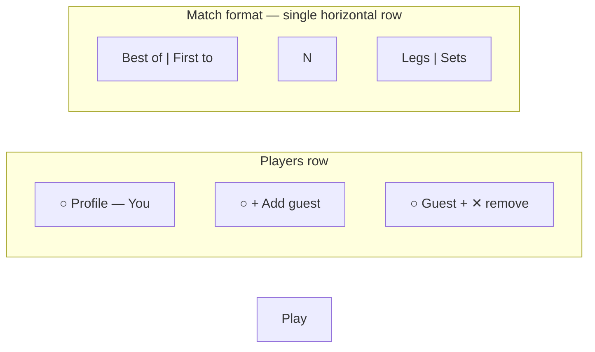

# 501 — Design Spec

> Input for `writing-plans` skill.

**Date:** 2026-06-29
**Branch:** TBD
**Scope:** Settings form (1–2 players), match format, starter selection, play UI, 501 scoring engine, leg/set progression, end-of-match summary, global player stats, game catalog release — for the `501` game mode

**UI reference:** `app/src/components/games/score-training/Play.astro`, `app/src/components/ui/NumberInputPad.astro`, `app/src/components/games/SummaryStatRow.astro`, `app/src/components/ui/RadioCard.astro`

**Approach:** Game module (mirror score-training / ten-up-one-down architecture)

---

## 1. Overview

Define the data model and requirements for **501** so a game can be configured, started, played (one visit submission per turn), and tracked for progress and lifetime statistics.

**Game summary:**


| Rule           | Value                                                         |
| -------------- | ------------------------------------------------------------- |
| Players        | 1 (default, logged-in user) or 2 (+ named guest)              |
| Starting score | 501 (fixed — not configurable)                                |
| Checkout       | Double-out (including bull)                                   |
| Bust           | Score reverts to start of visit; turn passes to opponent (2P) |
| Per visit      | Enter 3-dart visit total (0–180) via `NumberInputPad`         |
| Undo           | Unlimited consecutive (revert last submitted visit)           |
| Set format     | Always first-to-3 legs per set                                |
| Match unit     | Legs or sets — N applies to selected unit                     |
| Match mode     | Best of N or First to N                                       |
| 1P starter     | Skipped — logged-in player always starts                      |
| 2P starter     | "Who starts?" — tap player name (honor system)                |


**User flow:**

1. `/games` — 501 listed as released game (see §12)
2. `/games/settings-501` — configure players + match format; form shows defaults
3. If in-progress session exists → prompt: resume or abandon & start new
4. **Play** → POST settings → create session → `/games/501`
5. 2P only: starter screen ("Who starts?") before scoring
6. Play — enter visit score; Submit applies visit; turn alternates (2P)
7. Leg/set/match resolution on checkout
8. Optional undo last submitted visit (unlimited consecutive)
9. Match ends → client `buildSummary()` → summary shown immediately → POST stats → enable Play again / Back


| Item                | Value                                                              |
| ------------------- | ------------------------------------------------------------------ |
| Stack               | Astro 6, Tailwind CSS 4, Alpine.js 3, TypeScript                   |
| Storage             | Neon Postgres via data layer                                       |
| In-progress session | Alpine `$persist` (sessionStorage), same as score-training         |
| Stats persistence   | Global per logged-in player only; guest not persisted              |
| Summary display     | Client-computed before POST; buttons disabled until POST completes |


---

## 2. Decisions log (brainstorming)


| Topic                    | Decision                                                                      |
| ------------------------ | ----------------------------------------------------------------------------- |
| 1P play layout           | Single panel (no opponent row)                                                |
| 2P play layout           | Two panels side-by-side horizontally                                          |
| Scoring rules            | Standard 501: double-out, bust reverts, fixed 501                             |
| Sets                     | First-to-3 legs per set (fixed)                                               |
| 2-legs-difference toggle | Out of scope for v1                                                           |
| N semantics              | Applies to selected unit (legs or sets)                                       |
| 1P match format          | Full format fields; starter screen skipped                                    |
| Guest name entry         | Small modal (input + Confirm/Cancel)                                          |
| Guest removal            | Cross button top-right on guest avatar (50% offset, notification-badge style) |
| 2P starter               | "Who starts?" — both names tappable; no coin/bull method picker               |
| Completion               | Summary + POST stats; client summary first; buttons disabled until POST done  |
| Undo                     | Unlimited last-visit undo (same as score-training)                            |
| Catalog                  | Set `released: true` so 501 appears on `/games`                               |


---

## 3. Settings form requirements

### Layout




**Players row**


| Element        | Behavior                                                                                                                                    |
| -------------- | ------------------------------------------------------------------------------------------------------------------------------------------- |
| Logged-in user | Circular profile icon (`profile.svg`) + display name from preferences                                                                       |
| Add guest      | Circular `+` button; visible only when no guest added                                                                                       |
| Guest avatar   | Circular icon with guest initial or generic profile; guest name shown in play UI                                                            |
| Remove guest   | `cross.svg` button positioned top-right on guest avatar, 50% outside bounds (notification-badge offset); removes guest, restores `+` button |
| Default        | 1 player (logged-in user only)                                                                                                              |


**Guest name modal**

- Small modal overlay (same visual pattern as `ConfirmationModal`)
- `Input` for guest name
- Confirm / Cancel buttons
- Confirm disabled until non-empty trimmed name
- Cancel closes without adding guest

**Match format row**

Single horizontal row, three segments left-to-right:

1. **Left:** Radio cards — `Best of` | `First to` (`matchMode`)
2. **Center:** Number input — `targetCount` (N)
3. **Right:** Radio cards — `Legs` | `Sets` (`unit`)

Use `flex` with appropriate gap; number input centered between radio groups. Match existing `RadioCard` + `Input` styling from other settings pages.

### User-configurable fields


| Field         | Type                     | Default            | Validation                       |
| ------------- | ------------------------ | ------------------ | -------------------------------- |
| `matchMode`   | `"best-of" | "first-to"` | `"best-of"`        | required                         |
| `targetCount` | number                   | `3`                | integer; legs: 1–11; sets: 1–7   |
| `unit`        | `"legs" | "sets"`        | `"legs"`           | required                         |
| `players`     | `FiveOhOnePlayer[]`      | `[logged-in user]` | 1–2 players; user always present |


### Not in form (engine constants)


| Constant            | Value            |
| ------------------- | ---------------- |
| `startingScore`     | `501`            |
| `dartsPerVisit`     | `3`              |
| `legsPerSet`        | `3` (first-to-3) |
| `minVisitScore`     | `0`              |
| `maxVisitScore`     | `180`            |
| `doubleOutRequired` | `true`           |


Remove the existing `startingScore` field from `SettingsForm.astro`.

### Settings type

```ts
type FiveOhOnePlayer = {
  id: string;
  type: "user" | "guest";
  name: string;
};

type FiveOhOneSettings = {
  matchMode: "best-of" | "first-to";
  targetCount: number;
  unit: "legs" | "sets";
  players: FiveOhOnePlayer[];
};
```

### Match win conditions


| Mode       | Unit | Win condition                                    |
| ---------- | ---- | ------------------------------------------------ |
| `best-of`  | legs | First player to win `ceil(targetCount / 2)` legs |
| `first-to` | legs | First player to win `targetCount` legs           |
| `best-of`  | sets | First player to win `ceil(targetCount / 2)` sets |
| `first-to` | sets | First player to win `targetCount` sets           |


Each set: first player to 3 leg wins in that set wins the set; leg counts reset for next set.

### 1P leg semantics

- Each checkout completes a leg for the logged-in player
- Match ends when leg/set win condition is met (same math as 2P, single player accumulates all leg/set wins)
- No turn alternation; every visit is the logged-in player's turn

### Settings shell

Dedicated `FiveOhOneSettingsShell.astro` with Alpine `fiveOhOneSettings()`:

- Player picker state (guest modal open/close, guest name draft)
- `matchMode`, `unit` reactive fields (for validation hints if needed)
- Form POST to play URL (same pattern as `ScoreTrainingSettingsShell`)
- Hidden inputs or Alpine-managed fields for player data on submit
- Submit label: **Play**

Pass logged-in user's display name from server into settings shell for default player.

---

## 4. Architecture & data flow

```
SettingsForm (defaults)
  → parseFiveOhOneSettingsFormData(formData)
  → validateFiveOhOneSettings(parsed)
  → FiveOhOneSettings
  → POST /games/501
      → buildFiveOhOneSession(settings, startingPlayerId)
      → render Play with serverSession

Play page
  → Alpine $persist hydrates session (sessionStorage)
  → phase: starter (2P) | play | summary

Visit submit (play phase)
  → applyVisit(session, visitScore) on client
  → append visitHistory, update player remaining scores
  → handle bust / checkout / leg / set / match resolution
  → if match completed:
      summary = buildSummary(session)     // immediate
      showSummary = true
      persisting = true                   // disable buttons
      POST /api/games/501/complete
      persisting = false on success

Undo
  → revert last visit from visitHistory + state (client only)
```

### Client-side summary before POST

On match complete, **before** the API call:

1. `this.summary = buildSummary(this.session)` — pure function, shared module
2. `this.showSummary = true`
3. `this.persisting = true` — Play again and Back disabled
4. `POST /api/games/501/complete` with full session
5. On success: `this.persisting = false`; clear sessionStorage
6. On error: show error; keep summary visible; buttons remain disabled until retry succeeds

Server re-validates session and recomputes summary for stats application (does not block UI display).

---

## 5. File structure

```
app/src/icons/
  cross.svg                                    # new — guest remove button

app/src/lib/shared/games/501/
  constants.ts
  settings.ts
  form-data.ts
  validation.ts
  session.ts
  session-factory.ts
  visit.ts
  state.ts
  match.ts                                   # leg/set/match resolution
  summary.ts
  stats.ts
  completion.ts

app/src/lib/shared/darts/                      # reuse existing
  checkouts.ts                                 # getCheckoutHint(remaining)

app/src/lib/client/alpine/games/
  501.settings.ts
  501.play.ts

app/src/components/games/501/
  SettingsForm.astro
  FiveOhOneSettingsShell.astro
  PlayerPicker.astro
  GuestNameModal.astro
  StarterScreen.astro
  PlayerPanel.astro
  Play.astro
  Summary.astro
  PlayShellSkeleton.astro

app/src/pages/api/games/501/
  complete.ts

app/src/lib/server/data/
  player-501-stats.ts                          # new stats store

app/src/pages/games/settings-[game].astro        # wire 501 shell
app/src/pages/games/[game].astro                 # wire 501 session build
app/src/lib/shared/games/components.ts           # already registered
app/src/lib/shared/games/types.ts                # released: true
app/src/lib/client/alpine/app.factory.ts         # register Alpine factories
```

---

## 6. Session & state types

```ts
type FiveOhOneGameStatus = "active" | "completed";

type FiveOhOnePhase = "starter" | "play" | "summary";

type FiveOhOnePlayerState = {
  playerId: string;
  remaining: number; // current leg remaining (starts at 501 each leg)
  dartsThisLeg: number;
  lastVisitScore: number | null;
  legsWonInSet: number;
  setsWon: number;
};

type FiveOhOneGameState = {
  status: FiveOhOneGameStatus;
  phase: FiveOhOnePhase;
  currentPlayerId: string;
  currentLeg: number; // 1-based within current set
  currentSet: number; // 1-based
  players: FiveOhOnePlayerState[];
  scoreAtVisitStart: number; // for bust revert (current player's remaining before visit)
};

type FiveOhOneVisitRecord = {
  visitNumber: number;
  playerId: string;
  visitScore: number;
  remainingBefore: number;
  remainingAfter: number;
  bust: boolean;
  checkout: boolean;
  legNumber: number;
  setNumber: number;
};

type FiveOhOneSession = {
  slug: "501";
  settings: FiveOhOneSettings;
  state: FiveOhOneGameState;
  visitHistory: FiveOhOneVisitRecord[];
  createdAt: string;
  updatedAt: string;
};
```

### Derived values (computed, not stored)

Per player, current leg:

- `threeDartAverage = dartsThisLeg > 0 ? (501 - remaining) / (dartsThisLeg / 3) : 0`
- `checkoutHint = getCheckoutHint(remaining)` — null / bogey → hide hint

---

## 7. Scoring engine

Reuse and extend shared darts modules where possible.

### Visit application

```ts
applyVisit(session, visitScore): FiveOhOneSession
```

1. Validate visit score integer 0–180
2. Record `remainingBefore` = current player's `remaining`
3. Compute `remainingAfter = remainingBefore - visitScore`
4. Detect bust:
  - `remainingAfter < 0`
  - `remainingAfter === 1` (cannot finish on 1)
  - `remainingAfter === 0` but visit is not a valid double-out checkout
5. If bust: set `remainingAfter = remainingBefore`; mark `bust: true`; pass turn (2P)
6. If valid checkout (`remainingAfter === 0`): mark `checkout: true`; resolve leg win
7. Else: update remaining; increment `dartsThisLeg += 3`; pass turn (2P)

### Double-out validation

Use existing checkout constraint logic (`lib/shared/darts/checkout-constraints.ts` / solver) to verify that `visitScore` can finish `remainingBefore` on a double (or bull).

### Leg / set / match resolution

On checkout:

1. Increment winner's `legsWonInSet`
2. If `legsWonInSet >= 3`: increment winner's `setsWon`; reset both players' `legsWonInSet`; advance `currentSet`
3. Check match win via `matchMode` + `unit` + `targetCount`
4. If match won: `state.status = "completed"`; `state.phase = "summary"`
5. Else: start new leg — reset both players' `remaining = 501`, `dartsThisLeg = 0`, `lastVisitScore = null`; starter of next leg = player who did **not** start previous leg (standard alternation); 1P always self

### Undo

```ts
revertLastVisit(session): FiveOhOneSession
```

Pop last `visitHistory` entry; restore all affected state (remaining, darts, leg/set counts, current player, match status). Must handle undo across leg boundaries.

---

## 8. Play UI

### Phases


| Phase     | When                   | Content                                        |
| --------- | ---------------------- | ---------------------------------------------- |
| `starter` | 2P, before first visit | "Who starts?" + two tappable player name cards |
| `play`    | Active match           | Player panel(s) + `NumberInputPad`             |
| `summary` | Match complete         | Summary stats + Play again / Back              |


Show leg/set progress line above panels, e.g. `Set 1 · Leg 2` (omit set line when `unit === "legs"` and not in a sets match — always show leg number).

### 1 player — single column (`flex-col`)

```
┌─────────────────────────────────┐
│ You                             │  name
│ 501                             │  remaining score (large)
│ D20 D10                         │  checkout hint (when available)
│ 3-dart avg          85.3        │  SummaryStatRow
│ Last score            60        │  SummaryStatRow
│ Darts                 12        │  SummaryStatRow
├─────────────────────────────────┤
│         NumberInputPad          │
└─────────────────────────────────┘
```

- Panel always "active" styling (no muted state)
- Checkout hint: use `getCheckoutHint(remaining)`; show segment string below score when hint exists; hidden on bogey / no route

### 2 players — horizontal split

Same vertical order per panel, arranged side-by-side:

```
┌──────────────────┬──────────────────┐
│ You (active)     │ Guest (muted)    │
│ 501              │ 501              │
│ D20 D10          │ (hint if theirs) │
│ 3-dart avg  85.3 │ 3-dart avg  72.0 │
│ Last score    60 │ Last score    45 │
│ Darts         12 │ Darts          9 │
├──────────────────┴──────────────────┤
│         NumberInputPad              │
└─────────────────────────────────────┘
```


| State          | Styling                                                                |
| -------------- | ---------------------------------------------------------------------- |
| Current player | Active — accent border/background (match existing game panel patterns) |
| Other player   | Muted — reduced opacity                                                |


Guest section shows guest name (from settings) at top.

### NumberInputPad

Reuse `NumberInputPad.astro` as-is (same as score-training):

- `scoreModel="score"`
- `submitAction="submitVisit()"`
- `disabledExpr="controlsDisabled"`
- `canUndoExpr="visitHistory.length > 0"`
- `undoAction="undo()"`

### Starter screen (2P)

```
Who starts?

┌─────────────┐  ┌─────────────┐
│   {You}     │  │  {Guest}    │
└─────────────┘  └─────────────┘
```

Tapping a name sets `currentPlayerId`, advances `phase` to `play`.

### Leave

Confirmation modal (existing `confirmationModal` store). Abandons session; no stats update.

---

## 9. End-of-match summary

Client `buildSummary(session)` populates display immediately.

### Summary fields (v1)


| Field               | Source                                                      |
| ------------------- | ----------------------------------------------------------- |
| Result              | Won / Completed (1P: "Completed"; 2P: "{winner name} wins") |
| Match format        | e.g. "Best of 3 legs"                                       |
| Legs played         | Total legs completed                                        |
| Your 3-dart average | Logged-in user's match average                              |
| Your darts thrown   | Logged-in user's total darts                                |
| Checkouts           | Logged-in user's checkout count                             |


Guest stats shown on summary for context but not persisted.

### Actions


| Button           | Behavior                                                        |
| ---------------- | --------------------------------------------------------------- |
| Back (No)        | Navigate to `/games`; disabled while `persisting`               |
| Play again (Yes) | Rebuild session from same settings; disabled while `persisting` |


Use `:disabled="persisting"` and opacity/pointer-events guard (same pattern as score-training summary, but keyed on `persisting` not generic `loading`).

---

## 10. API — completion

`POST /api/games/501/complete`

**Request:** `{ session: FiveOhOneSession }`

**Auth:** Required (logged-in user)

**Server flow:**

1. `validateCompletedFiveOhOneSession(session)` — replay visitHistory, verify all state transitions
2. `buildSummary(session)` — server-side confirmation
3. `applyGameCompletionToStats(stats, session)` — logged-in user only
4. `savePlayer501Stats(userId, stats)`
5. `incrementPlayCount(userId, "501")`
6. Return `{ ok: true, summary }`

Guest player data in session is accepted but ignored for stats.

---

## 11. Global player stats

```ts
type Player501Stats = {
  gamesCompleted: number;
  gamesWon: number; // 2P wins only; 1P increments gamesCompleted but not gamesWon
  totalDartsThrown: number;
  totalCheckouts: number;
  bestLegAverage: number;
  bestMatchAverage: number;
};
```

Stored per user in data layer (`player-501-stats.ts`).

---

## 12. Game catalog release

501 must appear on `/games` (`app/src/pages/games.astro` loads released games via `getGameTypes()`).

**Changes on implementation completion:**

1. `SEED_GAMES` in `app/src/lib/shared/games/types.ts` — set `released: true` for `501`
2. New Drizzle migration — `UPDATE game_catalog SET released = true WHERE slug = '501'`
3. Update `tests/lib/shared/games/types.test.ts` — expect 501 as released
4. Update seed-game-catalog tests if applicable

No changes to `games.astro` itself — listing is driven by catalog data.

---

## 13. In-progress session on settings page

When an active 501 session exists in sessionStorage:

- Show banner: *"Game in progress"*
- **Resume** → navigate to play page
- **Abandon & start new** → clear session; show fresh form with defaults

Follow score-training pattern for detection (Alpine settings init check).

---

## 14. Testing

### Shared module tests (`tests/lib/shared/games/501/`)


| Module            | Cases                                                                     |
| ----------------- | ------------------------------------------------------------------------- |
| `validation`      | Settings bounds; player count; guest name required                        |
| `visit`           | Normal visit; bust (below 0, leaves 1, invalid checkout); valid checkout  |
| `match`           | Leg win; set win (first-to-3); match win best-of / first-to; legs vs sets |
| `state`           | Turn alternation; bust revert; leg reset                                  |
| `summary`         | 1P and 2P summary shapes                                                  |
| `completion`      | Replay validation rejects tampered sessions                               |
| `session-factory` | 1P and 2P initial state                                                   |


### Client tests


| File                   | Cases                                                                              |
| ---------------------- | ---------------------------------------------------------------------------------- |
| `501.settings.test.ts` | Guest add/remove modal; form defaults; match format row                            |
| `501.play.test.ts`     | Starter flow; visit submit; undo; summary before POST; persisting disables buttons |


### API tests


| File               | Cases                                                                          |
| ------------------ | ------------------------------------------------------------------------------ |
| `complete.test.ts` | Auth required; valid session; invalid/tampered session rejected; stats updated |


### Catalog tests

- 501 appears in `getGameTypes()` results after release flag update

---

## 15. Out of scope (v1)

- 2-legs-difference toggle
- Configurable starting score (301, 701, etc.)
- More than 2 players
- Coin toss / bull method picker on starter screen
- Online multiplayer / real-time sync
- Per-dart entry (only visit totals)

---

## 16. New assets


| Asset                     | Purpose                                       |
| ------------------------- | --------------------------------------------- |
| `app/src/icons/cross.svg` | Guest remove button on settings player picker |


Style: match existing icon set (stroke, `currentColor`, ~24px viewBox).